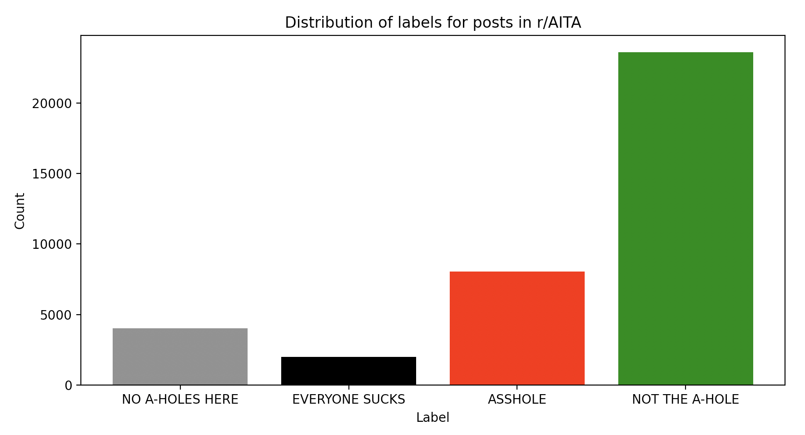
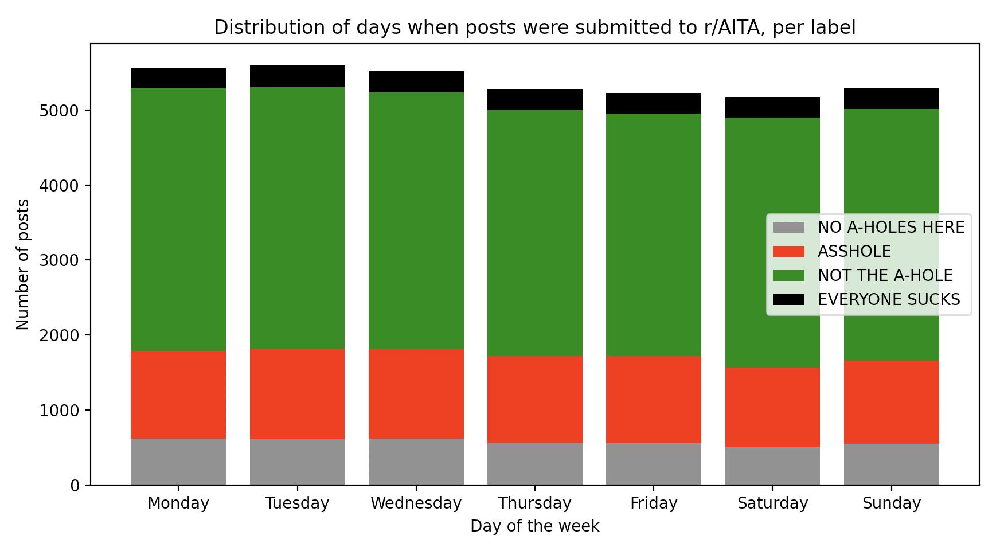
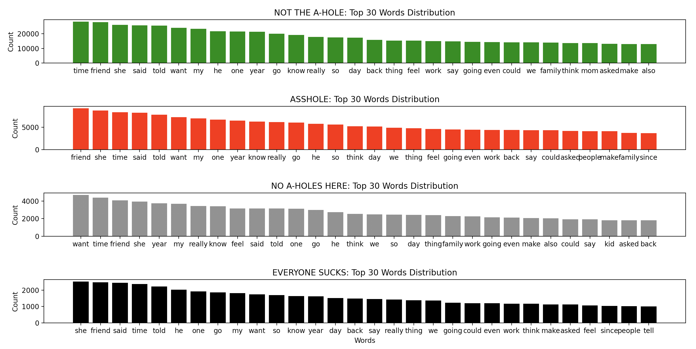

# SOEN 499 Project: Big Data for AITA

The following is a term project for the [SOEN 499 (Big Data Analytics)](https://users.encs.concordia.ca/~tglatard/teaching/big-data/) course in Winter 2020, taught by Dr. Tristan Glatard at Concordia University.

### Team Members

| Username         | Name                | Student ID |
| :--------------- | :------------------ | :--------- |
| `chimano`        | Chirac Manoukian    | 40028500   |
| `justin-cotarla` | Justin Cotarla      | 40027609   |
| `kwreen`         | Karen Bie           | 40018058   |
| `tehblasian`     | Jeremiah-David Wreh | 40028325   |

---

### Abstract

[Am I the A-hole (AITA)](https://www.reddit.com/r/AmItheAsshole/) is an online community on the popular social news website [Reddit](https://www.reddit.com). Users post descriptions of personal experiences asking the community to vote and determine whether or not they were the a-hole from the situation. In this report, we collect a large amount of posts from the AITA subreddit and subsequently analyze the dataset in order to predict what label will be assigned to a particular scenario as to find out who is in the wrong. The report aims to discuss the methods we used to pre-process the data and the performance of our model.

---

## I. Introduction

### I.a. Context

Am I the A-hole is a subreddit (i.e. a community on Reddit) where users submit posts describing a personal experience to then have the community decide on whether or not they were right under their given situation. When a post is submitted to the subreddit, community members may leave comments on it with their reactions and opinions on the described scenario from the post. Members also include a distinctive judgement label with their comment which they deem most appropriate for the situation, chosen from one of the following:

- You're the A-hole (YTA)
- You're Not the A-hole (NTA)
- Everyone Sucks Here (ESH)
- No A-holes here (NAH)
- Not Enough Info (INFO)

Members may as well upvote comments from the threads to signify that they agree with a commenter’s view. The judgement label from the comment with the most upvotes is the final label attributed to the original post as a way to indicate the consensus.

### I.b. Objectives

The objective of our project is to design a classification model to accurately predict which final judgement label would most likely reflect the general agreement of the AITA community in response to a given scenario. In the current state of the subreddit, a winning verdict is determined after 18 hours. With our project, a verdict would be more quickly brought to the table for conflicted users to find out if they had been in the wrong, and to be sooner rid of their worries.

### I.c. Related Works

> todo

_Liang, H., Sun, X., Sun, Y. et al. J Wireless Com Network (2017) 2017: 211. https://doi.org/10.1186/s13638-017-0993-1_

## II. Materials and Methods

### II.a. Dataset

[Pushshift](https://pushshift.io/) is a big data storage project that copies Reddit submissions and comments. Its goal is to provide a common API for anyone to access this data on a large scale. Using this, we will extract all the posts submitted to AITA including their labels.

Each item in the resultant dataset will have the following attributes that we deemed to be useful for classfication:

- Title - the title of the reddit post
- Content - the content of the reddit post
- Label - the concluded label associated to the post

The data extracted from Pushshift dates from Monday, February 24, 2014 9:50:51 PM to Saturday, April 4, 2020 8:41:28 PM. The number of posts retrieved total to 37679 items.

### II.b. Technologies and Algorithms

The core of the project is written in Python and requires version 3.5+. The project has been run with version 3.7.5. Apache Spark is used for this project in parallelizing computations on the data.

Natural language processing techniques are first used to clean up the data extracted from Pushshift. Code related to this process can be found under `/data_preparation`. Because the data consists of written texts from the title and content of the AITA posts, it is filtered and processed with normalization to enhance results by removing noise and keeping the core information only. The techniques used for this pre-processing are stopwords removal, digits removal, and lemmatization. We also chose to remove singular proper nouns (tagged as NNP by nltk) as many names are used by posters in telling their stories but we assume that they do not provide pertinence for classification. The cleaned data is prepared once and stored into a database on a server to be used by all following algorithms.

For the machine learning process, the code can be found under `/ml`. Three different classification techniques are applied on the data: Naive-Bayes, Random Forest and Support Vector Machines. For each of these techniques, three different data processing methods are used to numerically represent our data through vectors: word frequencies, TFIDF and Doc2Vec. The usage of word embeddings is important for this project because the importance of each word and their semantics in a text encapsulate information that may increase the performance of our models. Feature scaling was also applied to scale the vector range into [0,1] to satisfy the requirements for the algorithms, namely Naive-Bayes. The default ratio for training and test sets to be used is of 80-20 respectively.

To evaluate the results of the trained models, the F1 score, accuracy, precision and recall of the predictions are used as performance measures.

## III. Results

### III.a. A First Look at the Data

Before diving into the results obtained from applying machine learning classification techniques, we have chosen to take a first look at the data. Scripts for the generation of the following section's data can be found under `/data_exploration`.

The next three figures illustrate the statistical data obtained from observing the distribution of labels across the posts, the distribution of posts across week days, and the distributions of top words across different labels.

<p align="center">
     </br>
    Figure 1: Distribution of Labels for AITA Posts
</p>

From figure 1, the distribution tells us that the real data is greatly imbalanced with the majority of posts labelled as NTA. This observation has pushed us to later randomly undersample the posts labelled as NTA as to remove bias towards the majority class.

<p align="center">
     </br>
    Figure 2: Distribution of AITA Posts by Week Days
</p>

<p align="center">
     </br>
    Figure 3: Distributions of the Top 30 Words by Label
</p>

We also attempted to extract topics from the content of the posts using Latent Dirichlet Allocation (LDA). Modelling for the topics is mostly difficult due to the sheer amount of words involved and the few number of topics chosen to group by for all the data. The following are a few interesting results obtained through the process with topic labels that we have termed appropriately and tuples representing (word, weight_of_word_for_topic):

```
Topic 0: "Family"
('i', 0.058737517748202545)
('wedding', 0.013851375462612508)
('name', 0.012834816141956749)
('my', 0.011579272101059657)
('family', 0.010909367820150517)
('husband', 0.00810355276764783)
('would', 0.00773857722996206)
('want', 0.007291003499384249)
('child', 0.0068284651474224065)
('like', 0.0068162963353990405)

Topic 1: "Food"
('food', 0.048583658839314425)
('eat', 0.04744095305274857)
('eating', 0.021835719736446414)
('meat', 0.01929569588324601)
('cook', 0.01828335146548378)
('vegan', 0.0179028588735922)
('meal', 0.01737827811989212)
('i', 0.015973424706517296)
('dish', 0.012921412983558695)
('cooking', 0.011299819640166252)

Topic 2:  "Beliefs"
('temple', 0.009472794798211203)
('i', 0.004546260400681341)
('hindu', 0.001498963433516801)
('unicorn', 0.0010895702311568025)
('disorganised', 0.0005537448308678305)
('imovie', 0.0005525654754604156)
('he', 0.0005318494761121402)
('mormon', 0.00048748062270736824)
('sacredness', 0.0004510896817122591)
('ramadan', 0.0004500217435091548)
```

### III.b. Use of Classification Techniques

#### Naive-Bayes

> todo

#### Random Forest

> todo

#### Support Vector Machines

> todo

## IV. Discussion

> todo

In future work, it could be interesting to divide the data such that labels NTA, NAH, and INFO are grouped as one, and labels YTA and ESH are grouped as another. This would simplify the classification process by moving to binary decisions instead of attempting to categorize posts according to various labels that may be less represented.
